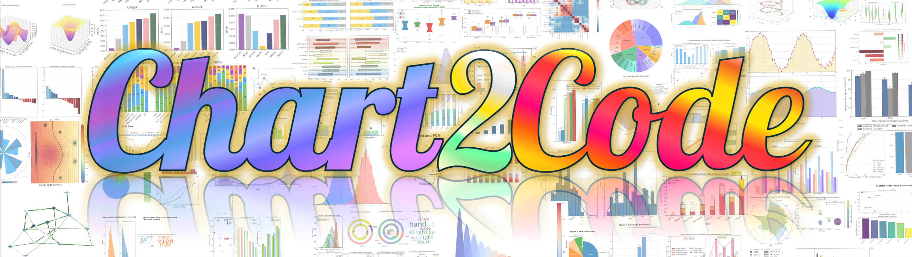
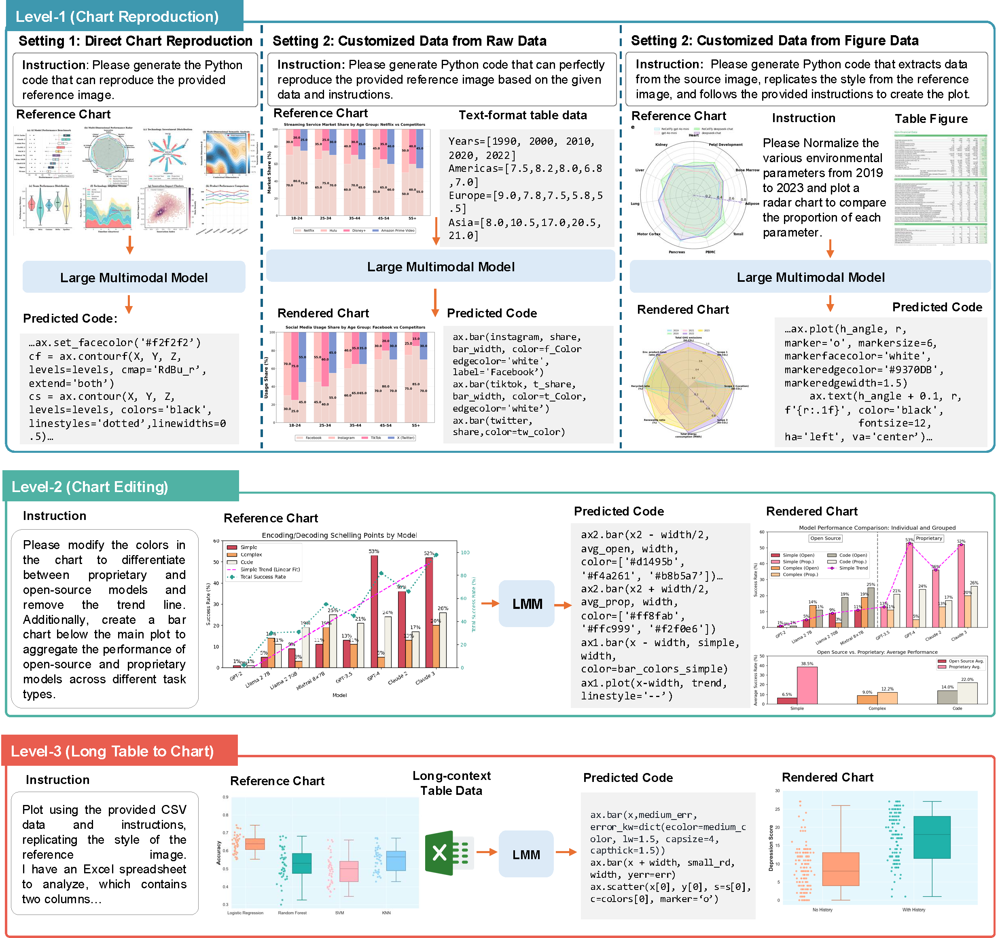

<p align="center" style="margin:0"></p>
<h2 align="center">From charts to code: a hierarchical benchmark for multimodal models</h2>

<h5 align="center"> 
Welcome to Chart2Code! If you find this repo useful, please give a star ⭐ for encouragement.
</h5>

<h5 align="center"> 
<!-- 
English | [中文](README_zh.md) -->

[](https://arxiv.org/abs/2502.08047) [](https://csu-jpg.github.io/Chart2Code.github.io/) [](https://github.com/CSU-JPG/Chart2Code) [](https://huggingface.co/datasets/CSU-JPG/Chart2Code)
</h5>


## 🌟 Overview

**Chart2Code-Benchmark** is a new benchmark designed to evaluate chart generation capabilities of LMMs under progressively challenging conditions. 
<p align="center" style="margin:0"></p>

**Chart2Code covers three progressively challenging levels:** reproduction, editing, and long-table to chart generation. <br>Level1(<b>Chart Reproduction</b>) reproduces charts from a reference figure and user query; <br>Level2(<b>Chart Editing</b>) involves complex modifications such as changing chart types or adding elements;<br>Level3(<b>Long-Table to Chart Generation</b>) requires models to transform long, information-dense tables into faithful charts following user instructions.

More details about Chart2Code in [project page](https://csu-jpg.github.io/Chart2Code.github.io/).🌐


## 🚀 Quick Start
Here we provide a quick start guide to evaluate LMMs on Chart2Code.

### Setup Environment
```shell
git clone https://github.com/showlab/Chart2Code.git
conda env create -f environment.yaml
conda activate chart2code
cd Chart2Code
```

Setup API key and API base URL in `.env` for different LMMs. Claude、 Gemini and GPT are accessed through API proxy providers，while Seed is accessed through ARK API.
```shell
OPENAI_API_KEY=${your_api_proxy_provider_key}
ARK_API_KEY=${your_ark_api_key}
OPENAI_API_URL=${your_api_proxy_provider_url}
ARK_BASE_URL=${your_ark_api_base_url}
```
### Download Data
Download the Chart2Code data from [Huggingface](https://huggingface.co/datasets/CSU-JPG/Chart2Code) and unzip it under the root directory.
```shell
cd data
wget https://huggingface.co/datasets/CSU-JPG/Chart2Code/tree/main/data.zip
unzip data.zip
cd ..
```
The file structure should be like this:
```Chart2Code
├── data
│   ├── level1_direct
│   │   ├── 3d_1.png
│   │   ├── 3d_1.py
│   │   └── ...
│   ├── level1_figure
│   │   ├── fig1_density_2
│   │   ├── ...
│   └── level1_customize
│       ├── table_1_instruction_2.png
│       ├── table_1_instruction_2.py
│       ├── table_1_instruction_2_request.txt
│       └── table_1_instruction_2_data.txt
│       └── ...
│   ├── level2
│   │   ├── bar_1_v1.png
│   │   ├── bar_1_v1.py
│   │   ├── bar_1_v1_data.txt
│   │   └── ...
│   └── level3
│       ├── table_1.xlsx
│       ├── table1_1.png
│       ├── table1_1_generate.py
│       ├── table1_1.txt
│       ├── table1_1_generate.png
│       └── ...
│   ├── level1_direct.json
│   ├── level1_figure.json
│   ├── level1_customize.json
│   ├── level2.json
│   └── level3.json
│—— Evaluation
└── ...
```

### Inference Setup

Inference for each benchmark level is handled by a dedicated shell script located in the `scripts/` directory.
You must specify a model for each run. You can do this in two ways:
-   Pass it as an argument (Recommended): Provide the `MODEL_IDENTIFIER` directly when executing the script.
-   Edit the script: Set the `MODEL_IDENTIFIER` variable inside the corresponding .sh file.

You can modify the `LOAD_SOURCE` parameter in the shell script to select how the model is loaded:
-   `local`: By default, the model will be loaded from the `Inference/models` directory.
-   `hub`: The model weights will be loaded directly from the Hugging Face Hub online.
   
You can also adjust other parameters like `GPU_VISIBLE_DEVICES`  in the script to fit your hardware setup.
```shell
cd scripts/inference
# For level1_customize
bash inference_customize.sh qwen3_customize_30B
# For level1_direct
bash inference_direct.sh qwen2.5_direct_72B
# For level1_figure
bash inference_figure.sh InternVL_3.5_figure_38B
# For level2
bash inference_level2.sh deepseek_level2
# For level3
bash inference_level3.sh gpt_5_level3
```
<details>
<summary>Available Models</summary>
We now support the following models:
<table>
  <tr>
    <th rowspan="2">Model Name</th>
    <th colspan="5">MODEL_IDENTIFIER</th>

  </tr>
  <tr>
    <th>level1_customize</th>
    <th>level1_direct</th>
    <th>level1_figure</th>
    <th>level2</th>
    <th>level3</th>
  </tr>
   <!-- InternVL 3.5 系列 -->
  <tr>
    <td>InternVL-3.5-38B</td>
    <td>InternVL_3.5_customize_38B</td>
    <td>InternVL_3.5_direct_38B</td>
    <td>InternVL_3.5_figure_38B</td>
    <td>InternVL_3.5_level2_38B</td>
    <td>InternVL_3.5_level3_38B</td>
  </tr>
  <tr>
    <td>InternVL-3.5-8B</td>
    <td>InternVL_3.5_customize_8B</td>
    <td>InternVL_3.5_direct_8B</td>
    <td>InternVL_3.5_figure_8B</td>
    <td>InternVL_3.5_level2_8B</td>
    <td>InternVL_3.5_level3_8B</td>
  </tr>
  
  <!-- InternVL 3 系列 -->
  <tr>
    <td>InternVL-3-38B</td>
    <td>InternVL_3_customize_38B</td>
    <td>InternVL_3_direct_38B</td>
    <td>InternVL_3_figure_38B</td>
    <td>InternVL_3_level2_38B</td>
    <td>InternVL_3_level3_38B</td>
  </tr>
  <tr>
    <td>InternVL-3-8B</td>
    <td>InternVL_3_customize_8B</td>
    <td>InternVL_3_direct_8B</td>
    <td>InternVL_3_figure_8B</td>
    <td>InternVL_3_level2_8B</td>
    <td>InternVL_3_level3_8B</td>
  </tr>
  
  <!-- InternVL 2.5 系列 -->
  <tr>
    <td>InternVL-2.5-38B</td>
    <td>InternVL_2.5_customize_38B</td>
    <td>InternVL_2.5_direct_38B</td>
    <td>InternVL_2.5_figure_38B</td>
    <td>InternVL_2.5_level2_38B</td>
    <td>InternVL_2.5_level3_38B</td>
  </tr>
  <tr>
    <td>InternVL-2.5-8B</td>
    <td>InternVL_2.5_customize_8B</td>
    <td>InternVL_2.5_direct_8B</td>
    <td>InternVL_2.5_figure_8B</td>
    <td>InternVL_2.5_level2_8B</td>
    <td>InternVL_2.5_level3_8B</td>
  </tr>
  
  <!-- Qwen 系列 -->
  <tr>
    <td>Qwen3-VL-30B</td>
    <td>qwen3_customize_30B</td>
    <td>qwen3_direct_30B</td>
    <td>qwen3_figure_30B</td>
    <td>qwen3_level2_30B</td>
    <td>qwen3_level3_30B</td>
  </tr>
  <tr>
    <td>Qwen3-VL-30B-think</td>
    <td>qwen3_customize_30B_think</td>
    <td>qwen3_direct_30B_think</td>
    <td>qwen3_figure_30B_think</td>
    <td>qwen3_level2_30B_think</td>
    <td>qwen3_level3_30B_think</td>
  </tr>
  
  <!-- Qwen2.5 系列 -->
  <tr>
    <td>Qwen2.5-VL-72B</td>
    <td>qwen2.5_customize_72B</td>
    <td>qwen2.5_direct_72B</td>
    <td>qwen2.5_figure_72B</td>
    <td>qwen2.5_level2_72B</td>
    <td>qwen2.5_level3_72B</td>
  </tr>
  <tr>
    <td>Qwen2.5-VL-7B</td>
    <td>qwen2.5_customize_7B</td>
    <td>qwen2.5_direct_7B</td>
    <td>qwen2.5_figure_7B</td>
    <td>qwen2.5_level2_7B</td>
    <td>qwen2.5_level3_7B</td>
  </tr>
  
  <!-- Qwen2 系列 -->
  <tr>
    <td>Qwen2-VL-72B</td>
    <td>qwen2_customize_72B</td>
    <td>qwen2_direct_72B</td>
    <td>qwen2_figure_72B</td>
    <td>qwen2_level2_72B</td>
    <td>qwen2_level3_72B</td>
  </tr>
  <tr>
    <td>Qwen2-VL-7B</td>
    <td>qwen2_customize_7B</td>
    <td>qwen2_direct_7B</td>
    <td>qwen2_figure_7B</td>
    <td>qwen2_level2_7B</td>
    <td>qwen2_level3_7B</td>
  </tr>
  
  <!-- MOLMO 系列 -->
  <tr>
    <td>MOLMO-7B-D</td>
    <td>molmo_customize_7BD</td>
    <td>molmo_direct_7BD</td>
    <td>molmo_figure_7BD</td>
    <td>molmo_level2_7BD</td>
    <td>molmo_level3_7BD</td>
  </tr>
  
  <!-- MIMO 系列 -->
  <tr>
    <td>MIMO-VL-7B-RL-think</td>
    <td>mimo_RL_customize_think</td>
    <td>mimo_RL_direct_think</td>
    <td>mimo_RL_figure_think</td>
    <td>mimo_RL_level2_think</td>
    <td>mimo_RL_level3_think</td>
  </tr>
  <tr>
    <td>MIMO-VL-7B-RL-nothink</td>
    <td>mimo_RL_customize_nothink</td>
    <td>mimo_RL_direct_nothink</td>
    <td>mimo_RL_figure_nothink</td>
    <td>mimo_RL_level2_nothink</td>
    <td>mimo_RL_level3_nothink</td>
  </tr>
  <tr>
    <td>MIMO-VL-7B-SFT-nothink</td>
    <td>mimo_SFT_customize_nothink</td>
    <td>mimo_SFT_direct_nothink</td>
    <td>mimo_SFT_figure_nothink</td>
    <td>mimo_SFT_level2_nothink</td>
    <td>mimo_SFT_level3_nothink</td>
  </tr>
  <tr>
    <td>MIMO-VL-7B-SFT-think</td>
    <td>mimo_SFT_customize_think</td>
    <td>mimo_SFT_direct_think</td>
    <td>mimo_SFT_figure_think</td>
    <td>mimo_SFT_level2_think</td>
    <td>mimo_SFT_level3_think</td>
  </tr>
  
  <!-- LLaVA 系列 -->
  <tr>
    <td>LLaVA-OV-Qwen2-7B-OV</td>
    <td>llava_ov_customize</td>
    <td>llava_ov_direct</td>
    <td>llava_ov_figure</td>
    <td>liava_ov_level2</td>
    <td>llava_ov_level3</td>
  </tr>
  <tr>
    <td>LLaVA-OV-Qwen2-7B-SI</td>
    <td>llava_si_customize</td>
    <td>llava_si_direct</td>
    <td>llava_si_figure</td>
    <td>llava_si_level2</td>
    <td>llava_si_level3</td>
  </tr>
  
  <!-- SEED 系列 -->
  <tr>
    <td>SEED-1.6-VL</td>
    <td>seed_1.6_customize</td>
    <td>seed_1.6_direct</td>
    <td>seed_1.6_figure</td>
    <td>seed_1.6_level2</td>
    <td>seed_1.6_level3</td>
  </tr>
  <tr>
    <td>SEED-1.5-VL</td>
    <td>seed_1.5_customize</td>
    <td>seed_1.5_direct</td>
    <td>seed_1.5_figure</td>
    <td>seed_1.5_level2</td>
    <td>seed_1.5_level3</td>
  </tr>
  
  <!-- 其他模型 -->
  <tr>
    <td>Claude-Sonnet-4</td>
    <td>claude_customize</td>
    <td>claude_direct</td>
    <td>claude_figure</td>
    <td>claude_level2</td>
    <td>claude_level3</td>
  </tr>
  <tr>
    <td>DeepSeek-VL-7B</td>
    <td>deepseek_customize</td>
    <td>deepseek_direct</td>
    <td>deepseek_figure</td>
    <td>deepseek_level2</td>
    <td>deepseek_level3</td>
  </tr>
  <tr>
    <td>Gemini-2.5-Pro</td>
    <td>gemini_2.5_customize</td>
    <td>gemini_2.5_direct</td>
    <td>gemini_2.5_figure</td>
    <td>gemini_2.5_level2</td>
    <td>gemini_2.5_level3</td>
  </tr>
  <tr>
    <td>GLM-4V-9B</td>
    <td>glm_customize</td>
    <td>glm_direct</td>
    <td>glm_figure</td>
    <td>glm_level2</td>
    <td>glm_level3</td>
  </tr>
  <tr>
    <td>GPT-5</td>
    <td>gpt_5_customize</td>
    <td>gpt_5_direct</td>
    <td>gpt_5_figure</td>
    <td>gpt_5_level2</td>
    <td>gpt_5_level3</td>
  </tr>
  <tr>
    <td>Kimi-VL-A3B</td>
    <td>kimi_customize</td>
    <td>kimi_direct</td>
    <td>kimi_figure</td>
    <td>kimi_level2</td>
    <td>kimi_level3</td>
  </tr>
</table>
</details>


### Evaluate Setup

For the results obtained from inference, the first step is to check the execution rate. The code that runs successfully and its corresponding generated images will undergo the following evaluations: `base_evaluation`, `LLM_evaluation`, and `LMM_evaluation`.
```shell
cd scripts/evaluate
# step1: check execution rate
bash execute_evaluate.sh
# step2: run base evaluation
bash base_evaluator.sh
# step3: run LLM evaluation to evaluate the code
bash LLM_evaluator.sh
# step4: run LMM evaluation to evaluate the image
bash LMM_evaluator.sh
```
## 📢 Update

* [2025.02.13] We release the Chart2Code in [arxiv](https://arxiv.org/abs/2502.08047).


## ❤ Acknowledgement
- Special thanks to Henry Hengyuan Zhao for serving as the Project Leader of this paper.

- We are grateful to Lijian Wu and Ziyuan Zhen for their hard work in data annotation and baseline testing.

- We also extend our appreciation to Mao Dongxing, Yifei Tao, Lijian Wu, and Wan Yang for their contributions to this work.

## 🎓 BibTeX

If you find WorldGUI useful, please cite using this BibTeX:

```bibtex
@misc{zhao2025worldguiinteractivebenchmarkdesktop,
      title={WorldGUI: An Interactive Benchmark for Desktop GUI Automation from Any Starting Point}, 
      author={Henry Hengyuan Zhao and Kaiming Yang and Wendi Yu and Difei Gao and Mike Zheng Shou},
      year={2025},
      eprint={2502.08047},
      archivePrefix={arXiv},
      primaryClass={cs.AI},
      url={https://arxiv.org/abs/2502.08047}, 
}
```


## 🔔 Contact
If you have any questions or suggestions, please don't hesitate to let us know. You can directly email Jiahao Tang at tangjh36@mail2.sysu.edu.cn or post an issue on this repository. We welcome contributions. Feel free to submit pull requests if you have suggestions for improvement.

